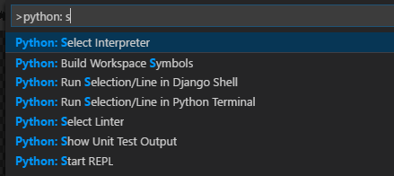

# pysample-vscode: simple helloworl for use VSCODE + Python + virtualenv + git


Create your repo on github 

```
echo "# pysample-vscode" >> README.md
git init
git add README.md
git commit -m "first commit"
git branch -M main
git remote add origin https://github.com/alekonko/pysample-vscode.git
git push -u origin main
```

Create right .gitignore files, can you use online generator, [this](https://docs.gitignore.io/install/command-line#git)   offer easy api scripts

- for PSH
```psh
#creo funzione, For PowerShell v3
Function gig {
  param(
    [Parameter(Mandatory=$true)]
    [string[]]$list
  )
  $params = ($list | ForEach-Object { [uri]::EscapeDataString($_) }) -join ","
  Invoke-WebRequest -Uri "https://www.toptal.com/developers/gitignore/api/$params" | select -ExpandProperty content | Out-File -FilePath $(Join-Path -path $pwd -ChildPath ".gitignore") -Encoding ascii
}

# creo .gitignore
gig "vscode","python","windows"

```

- for bash
```
function gig() { curl -sL https://www.toptal.com/developers/gitignore/api/\$@ ;}"

gig vscode python
```

Create virtual env for your project

```
py -3 -m venv .venv
```

activate venv

```
.venv\scripts\activate
```

update pip (if needed)
  
```
C:\dev\python\.venv\scripts\python.exe -m pip install --upgrade pip
```

From officials documentation [python/environments](https://code.visualstudio.com/docs/python/environments)

To select a specific environment, use the Python: Select Interpreter command from the Command Palette (Ctrl+Shift+P).

 

You can switch environments at any time; switching environments helps you test different parts of your project with different interpreters or library versions as needed.

The Python: Select Interpreter command displays a list of available global environments, conda environments, and virtual environments. (See the Where the extension looks for environments section for details, including the distinctions between these types of environments.) The following image, for example, shows several Anaconda and CPython installations along with a conda environment and a virtual environment (env) that's located within the workspace folder:

 


Use pip for install your favourite module and start coding

Create requirements at the end of project with pip freeze and put it in requirements.txt

```
pip freeze > requirements.txt
```

- install requirements

```
pip install -r requirements.txt
```

Push on you repo


bye
Ale